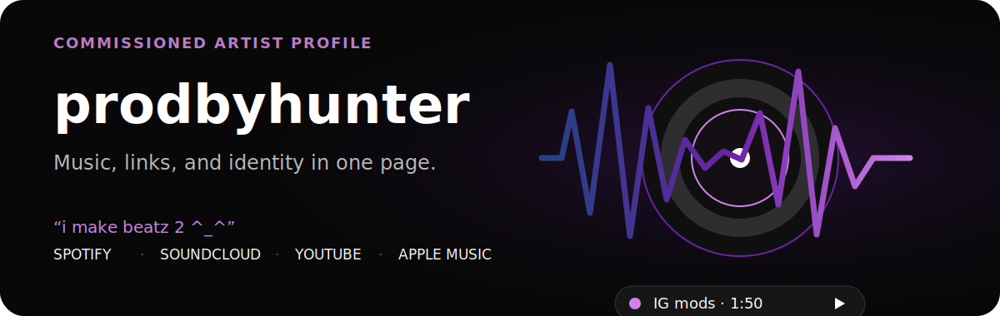

<p align="center">
  
</p>

<p align="center">
  <a href="https://music-landing-page-commissioned.vercel.app"><strong>View the live page</strong></a>
  ·
  <a href="#what-is-in-this-repository">Repository contents</a>
  ·
  <a href="#serve-it-locally">Run locally</a>
</p>

A commissioned, single-page music profile for **prodbyhunter**. The page
packages an artist introduction, rotating status copy, track playback, and
social destinations into a compact dark-mode link hub.

## The page at a glance

```text
enter screen
    ↓
artist identity + profile image
    ↓
rotating message and selected track
    ↓
Spotify · SoundCloud · TikTok · YouTube · Apple Music · Instagram
```

The exported design uses a near-black canvas, cool blue-to-purple accents,
white icon glow, rain effects, and a compact centered profile composition.

## What is in this repository

This repository is a **static export**, not the original editable Next.js
source project.

```text
index.html       complete exported profile page
css/             compiled styles
chunks/          compiled browser bundles
_next/static/    Next.js static assets
```

That makes the repository suitable for static hosting, but not for editing the
original React components. Content changes must be made carefully in the
exported document or regenerated from the original profile source.

## Serve it locally

No build step is required:

```bash
git clone https://github.com/ChinesePrince07/music-landing-page-commissioned.git
cd music-landing-page-commissioned
python3 -m http.server 8000
```

Open `http://localhost:8000`.

Any static file server works, including:

```bash
npx serve .
```

## Deployment

Deploy the repository root as a static site. The checked-in `index.html`
already references the included compiled CSS and JavaScript assets.

The profile also references media hosted outside this repository. Availability
of remote profile images, background media, audio, analytics, and font assets
depends on their original hosts.

## Design notes

- **Audience:** listeners arriving from a social profile
- **Primary action:** choose a music or social destination
- **Primary proof:** the published profile itself
- **Visual motif:** a luminous waveform on an almost-black stage
- **Interaction:** one compact path from identity to listening

This repository intentionally stays small and deployment-oriented: it preserves
the commissioned output rather than pretending the compiled bundle is a
maintainable application source tree.
